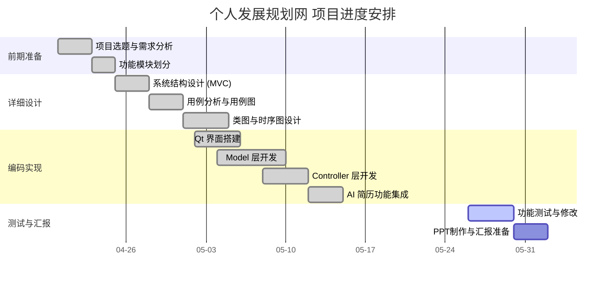

# 基于 Qt 的学生信息管理系统

## 一、项目简介

本项目是一个基于 Qt 开发的学生信息管理系统（个人发展规划网），采用 MVC（模型-视图-控制器）架构风格，帮助学生记录学习历程、管理成就、生成简历。

**⚠️ 当前版本为 macOS 版本，Windows 平台可能不适配。**

## 二、当前完成情况

- [x] 完成项目选题
- [x] 完成需求分析
- [x] 完成系统功能模块划分
- [x] 完成详细设计文档
- [x] 完成 Qt 界面设计
- [x] 完成核心代码编写
- [ ] 完成测试与修改
- [ ] 完成最终汇报 PPT

## 三、核心功能

- 批量导入课程与成绩（CSV/JSON）
- GPA 统计分析与学期趋势图
- 成就记录（奖项、班级角色、志愿者）
- 标准简历导出
- AI 简历增强（DeepSeek API → HTML 网页）
- 数据备份与恢复
- 用户登录/注册（学生 & 管理员）

## 四、项目结构

```
├── README.md
├── LICENSE
├── CHANGELOG.md
├── src/
│   ├── PersonalDevPlan.pro
│   ├── main.cpp
│   ├── model/          # 数据模型层
│   ├── view/           # 视图层 (Qt UI)
│   ├── controller/     # 控制器层
│   ├── service/        # AI 服务层
│   └── icons/          # 图标资源
├── docs/
│   ├── 设计文档.md
│   ├── 使用说明.md     # 安装、账号密码、功能说明
│   ├── 用例图.jpeg
│   ├── 类图.jpeg
│   └── 时序图.png
├── tests/
└── .github/workflows/
```

## 五、使用说明

详见 [docs/使用说明.md](docs/使用说明.md)

### 快速开始
1. 从 [Releases](https://github.com/xuletian2007-stack/qt-student-management-system/releases) 下载 `PersonalDevPlan-macOS.dmg`
2. 双击打开，拖 app 到 Applications
3. 运行，使用内置账号登录（例如 喜羊羊 / 35060525）

### 管理员账号
| 用户名 | 密码 |
|--------|------|
| 小灰灰 | 35131001 |

管理员可查看和编辑所有学生数据。

## 六、小组分工

| 成员 | MVC 角色 | 职责描述 |
|------|---------|---------|
| 郑润泽 | System Architect | MVC 交互协议设计；Model/View/Controller 接口规范 |
| 徐乐天 | Model (Logic) | GPA 计算模型及算法实现；学分与绩点核心逻辑 |
| 彭旭辉 | Model (Data) | 成就/角色数据模型；CRUD 逻辑及本地文件持久化 |
| 黄耀康 | Service/Controller | AI 业务流控制；Model 数据封装、API 调用、结果反馈 |
| 蒋宇 | View & Controller | Qt 界面开发；信号槽逻辑、用户操作响应 |

## 七、详细设计任务分解

| 模块 | 负责人 | 当前状态 |
|------|--------|---------|
| 登录模块 | 蒋宇 | 已完成 |
| 学生信息录入模块 | 徐乐天 | 已完成 |
| 成绩查询与 GPA 统计 | 徐乐天 | 已完成 |
| 成就记录管理 | 彭旭辉 | 已完成 |
| 简历导出 | 徐乐天 | 已完成 |
| AI 简历生成 | 黄耀康 | 已完成 |
| 数据备份与恢复 | 彭旭辉 | 已完成 |
| 界面设计 | 蒋宇 | 已完成 |
| 架构设计与集成 | 郑润泽 | 已完成 |
| 测试与验收 | 全员 | 进行中 |

## 八、项目甘特图


