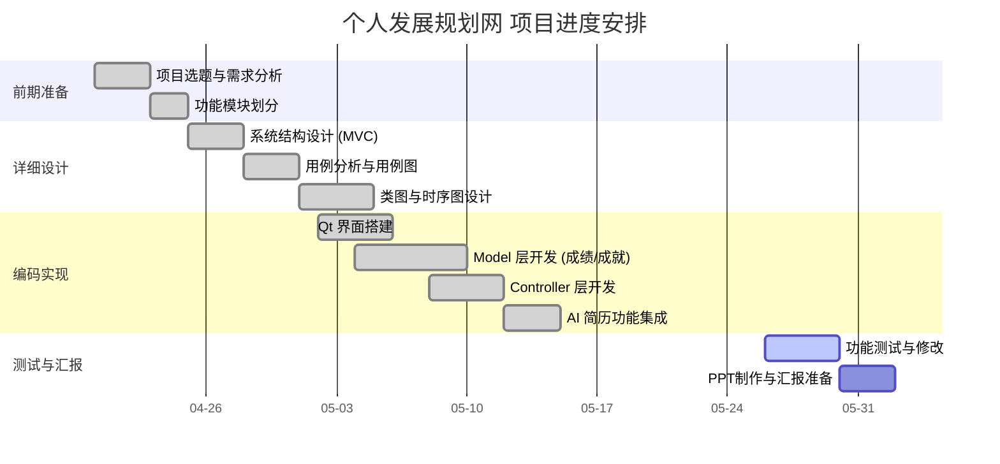

# 基于 Qt 的学生信息管理系统

## 一、项目简介

本项目是一个基于 Qt 开发的学生信息管理系统，采用 MVC（模型-视图-控制器）架构风格，帮助学生记录学习历程、管理成就、生成简历。

## 二、当前完成情况

- [x] 完成项目选题
- [x] 完成需求分析
- [x] 完成系统功能模块划分
- [x] 完成详细设计文档
- [x] 完成 Qt 界面设计
- [x] 完成核心代码编写
- [ ] 完成测试与修改
- [ ] 完成最终汇报 PPT

## 三、小组分工

| 成员 | MVC 角色 | 职责描述 |
|------|---------|---------|
| 郑润泽 | System Architect | 定义 MVC 交互协议；设计 Model/View/Controller 接口规范；确保代码耦合度低 |
| 徐乐天 | Model (Logic) | 负责 GPA 计算模型及算法实现；处理学分与绩点的核心数学逻辑 |
| 彭旭辉 | Model (Data) | 负责成就、角色、志愿者数据模型；实现 CRUD 逻辑及本地文件持久化 |
| 黄耀康 | Service/Controller | 负责 AI 业务流控制；将 Model 层数据封装并调用外部 API，结果反馈给 View |
| 蒋宇 | View & Controller | 负责 Qt 界面开发 (View)；编写信号槽逻辑响应用户操作并调用 Model |

## 四、详细设计任务分解

| 模块 | 负责人 | 当前状态 |
|------|--------|---------|
| 登录模块 | 蒋宇 | 已完成 |
| 学生信息录入模块 | 徐乐天 | 已完成 |
| 成绩查询与 GPA 统计 | 徐乐天 | 已完成 |
| 成就记录管理 | 彭旭辉 | 已完成 |
| 简历导出 | 徐乐天 | 已完成 |
| AI 简历生成 | 黄耀康 | 已完成 |
| 数据备份与恢复 | 彭旭辉 | 已完成 |
| 界面设计 | 蒋宇 | 已完成 |
| 架构设计与集成 | 郑润泽 | 已完成 |
| 测试与验收 | 全员 | 进行中 |

## 五、项目甘特图

