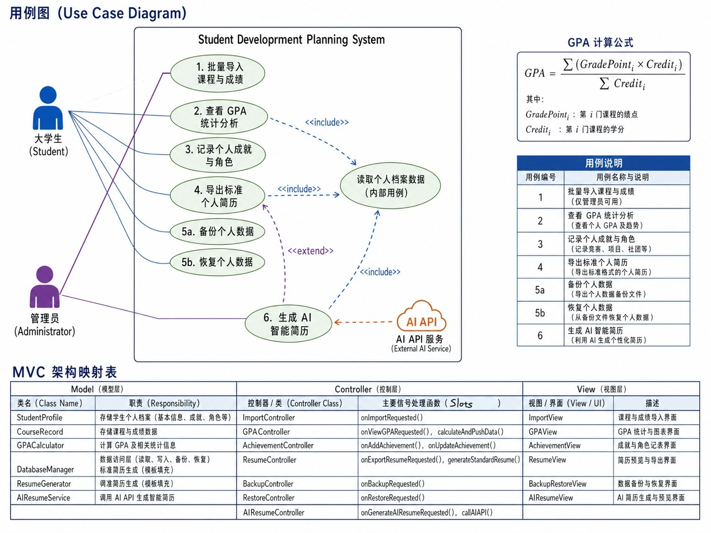
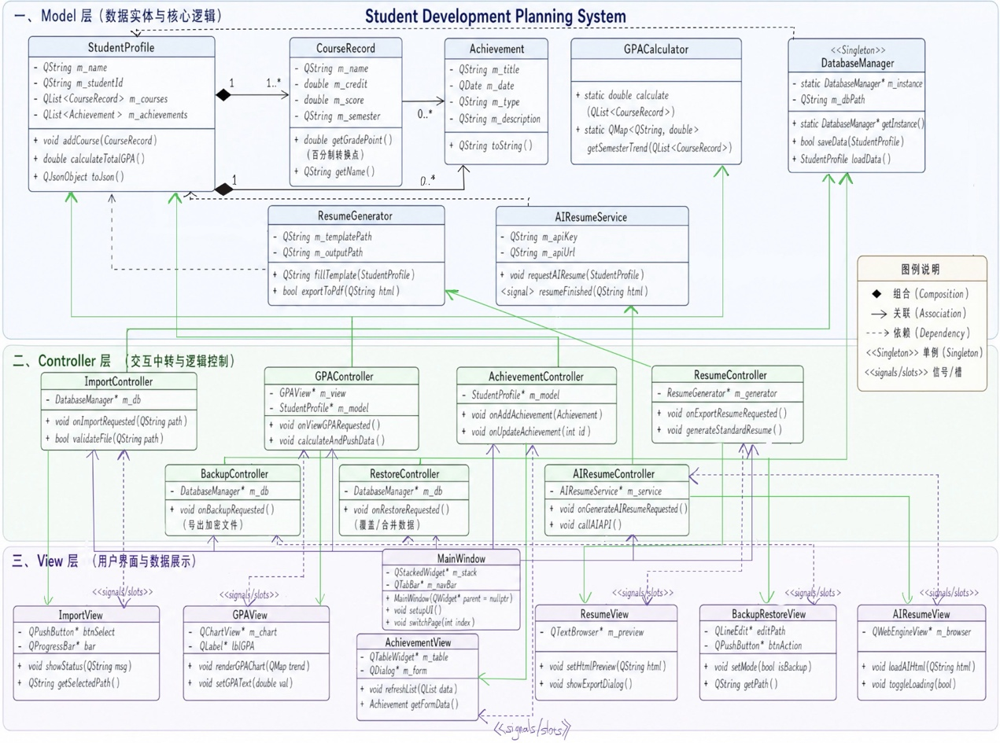

# 个人发展规划网 — 设计文档

## 1. 项目概述

**项目名称：** 个人发展规划网（PersonalDevPlan）

**主题：** 帮助学生记录和追踪四年学习历程，对学习、能力、经历与未来目标进行记录、分析、规划与展示。

## 2. 体系结构风格选择：MVC（模型-视图-控制器）

### 选择理由

| 层 | 职责 |
|---|------|
| **Model（模型）** | GPA 计算逻辑和本地数据的存取（课程信息、奖项记录等） |
| **View（视图）** | Qt 框架开发的本地窗口界面，展示学生信息及 AI 生成的简历网页 |
| **Controller（控制器）** | 处理用户点击逻辑，调用 AI API 进行跨模块通信 |

**优势：** 业务逻辑与界面解耦，方便 4-5 人团队模块化分工协作。

## 3. 功能需求

### 核心功能
- **成绩管理：** 记录所学课程及分数，自动进行 GPA 计算
- **信息记录：** 登记奖项、荣誉、学习历程、班级/社团角色
- **简历生成：** 导出一份完整的个人简历

### 创新功能
- **AI 简历增强：** 调用外部 API，利用 AI 将录入数据转化为美观的 HTML 简历网页

### 非功能需求
- **离线运行：** 本地可执行程序，无需连接服务器即可处理核心数据
- **版本管理：** 使用 Git 进行开发过程管理

## 4. 用例分析

### 参与者

| 参与者 | 描述 |
|--------|------|
| 大学生 (Student) | 核心用户，负责记录学习历程、管理成就并触发简历生成 |
| 管理员 (Administrator) | 负责从教务系统或外部文件批量导入课程和初始成绩 |
| AI API 服务 (External AI Service) | 支撑创新功能的外部系统（DeepSeek API），处理数据并返回 HTML 简历代码 |

### 用例 1：批量导入课程与成绩
- **参与者：** 管理员
- **前置条件：** 管理员已准备好符合格式的外部数据文件（CSV/JSON）
- **基本路径：**
  1. 管理员在系统设置中选择"批量导入"
  2. 系统弹出文件选择对话框
  3. 系统校验文件格式及数据合法性
  4. 系统解析文件，将课程名称、学分、成绩写入本地数据库
  5. 系统提示导入成功，自动触发全局 GPA 更新
- **后置条件：** 本地数据库更新，学生可直接查看学习记录

### 用例 2：查看 GPA 统计分析
- **参与者：** 大学生
- **前置条件：** 系统中已存在至少一门已评分的课程记录
- **基本路径：**
  1. 用户进入"学业看板"页面
  2. 系统提取所有课程数据，计算 GPA：
     $$GPA = \frac{\sum (成绩点 \times 学分)}{\sum 总学分}$$
  3. 以数字和折线图展示各学期趋势
- **后置条件：** 用户直观掌握学业水平

### 用例 3：记录个人成就与角色
- **参与者：** 大学生
- **前置条件：** 用户处于"成长历程记录"页面
- **基本路径：**
  1. 用户选择记录类别（奖项/班级角色/志愿者经历/其他）
  2. 用户填写具体内容（标题、时间、级别、职责描述）
  3. 可上传相关证明材料（奖状照片路径）
  4. 点击"保存"，系统按时间排列并存储
- **后置条件：** 个人成就库更新，作为简历原始素材

### 用例 4：导出标准个人简历
- **参与者：** 大学生
- **前置条件：** 系统内已有足够的个人数据
- **基本路径：**
  1. 用户点击"导出简历"
  2. 系统提取所有成绩、奖项及角色信息
  3. 系统套用预设简历模板，整理成规范文档
  4. 弹出保存对话框，用户选择路径
- **后置条件：** 本地生成一份完整的简历文件

### 用例 5：数据备份与恢复
- **参与者：** 大学生
- **基本路径：**
  1. 数据备份：系统将当前所有记录打包成加密文件
  2. 数据恢复：读取备份文件并覆盖/合并本地数据库
- **后置条件：** 确保四年记录不会因系统重装或软件问题丢失

## 5. MVC 映射

| 用例 | Model（数据与逻辑） | View（用户界面） | Controller（交互中转） |
|------|---------------------|------------------|------------------------|
| 批量导入成绩 | CSV/JSON 解析器；数据校验算法；本地数据库写入 | QFileDialog；导入进度条；成功/失败弹窗 | 监听"导入"点击；调用解析器；处理异常反馈 |
| GPA 统计分析 | GPA 计算引擎；历史数据查询逻辑 | QtCharts 折线图；GPA 数值标签 | 页面加载触发数据读取；计算结果推送图表 |
| 记录成就角色 | Achievement 类；数据持久化；时间排序算法 | 录入表单（下拉框/文本域）；上传按钮 | 验证表单完整性；封装数据对象；调用 Model 保存 |
| 导出个人简历 | 简历模板引擎；数据聚合逻辑；文件导出接口 | "导出"按钮；保存路径选择框 | 提取全量数据；选择模板；触发生成流程 |
| 数据备份恢复 | 加密/压缩算法；文件系统读写流 | 备份/恢复设置页面；确认对话框 | 时序控制；确保恢复后界面刷新 |

## 6. 类图

## 7. 详细设计 / 时序图

## 8. 技术栈

- **语言：** C++ (C++11)
- **框架：** Qt 5.9.1
- **编译器：** Clang (macOS), MinGW 32-bit (Windows)
- **版本管理：** Git + GitHub
- **AI 服务：** DeepSeek API
